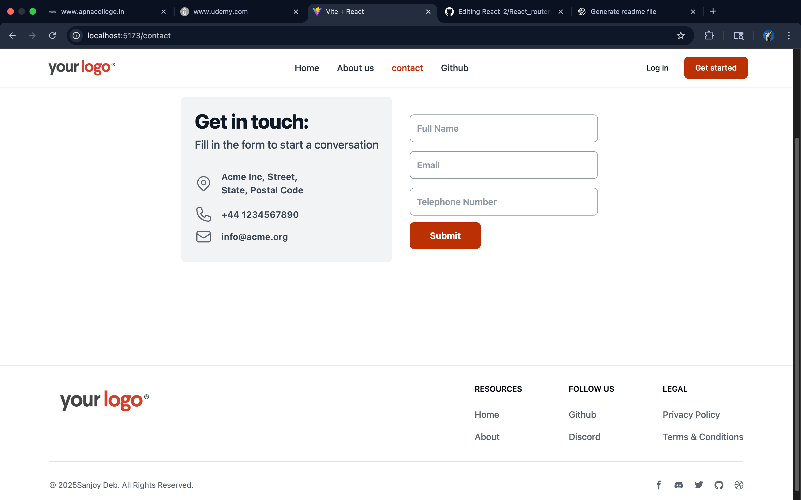

# React Routers Project

## 📸 Screenshots



This project demonstrates how to use **React Router** for building a simple, responsive, multi-page application using React. It includes navigation using `react-router-dom` and styling with **Tailwind CSS**.

## 🚀 Features

- React Router v6+ for navigation
- Responsive layout
- Navigation bar using `NavLink`
- Tailwind CSS for styling
- Sticky header
- Basic routing setup with pages like Home, About, and Contact

## 🛠️ Technologies Used

- React
- React Router DOM
- Tailwind CSS
- Vite (assumed as bundler – confirm if different)

## 📂 Project Structure

```
React_routers/
├── components/
│ └── Header.jsx # Navbar with routing links
├── pages/
│ ├── Home.jsx # Home page
│ ├── About.jsx # About page
│ └── Contact.jsx # Contact page
├── App.jsx # Main app with routes
└── main.jsx # Entry point for React
```


## 🧪 Getting Started

### 1. Clone the repo

```bash
git clone https://github.com/Sanjoy-ui/React-2.git
cd React_2/React_routers
```
## 2. Install dependencies
```
npm install
npm run dev

```
## 🔗 Example Routes
- / → Home Page

- /about → About Page

- /contact → Contact Page
  
